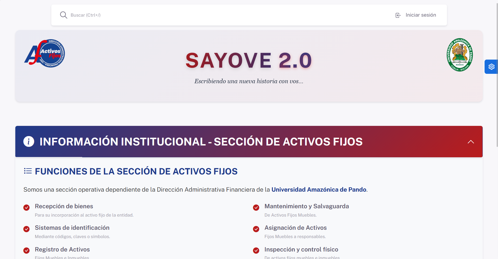
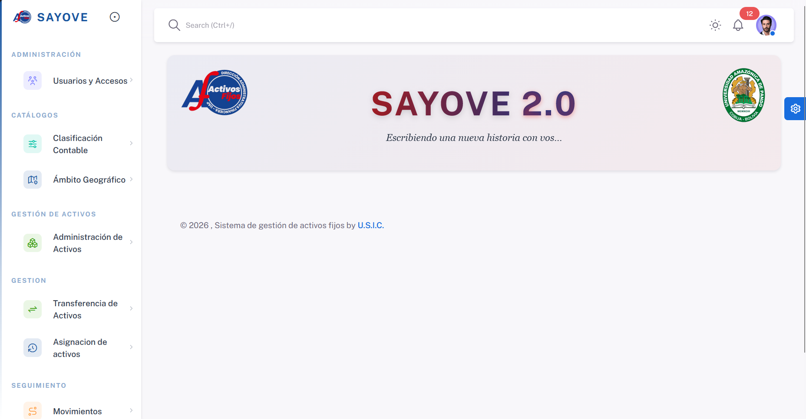
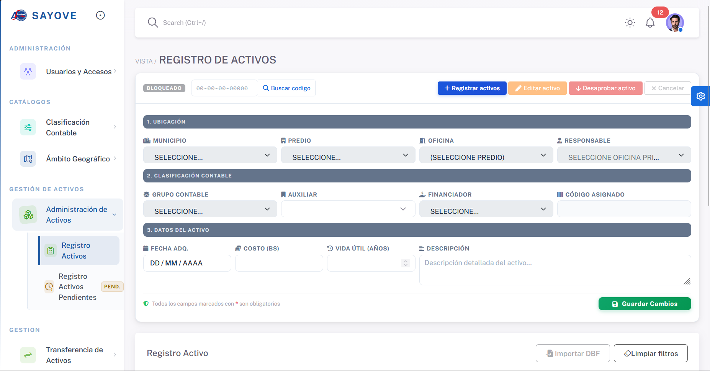
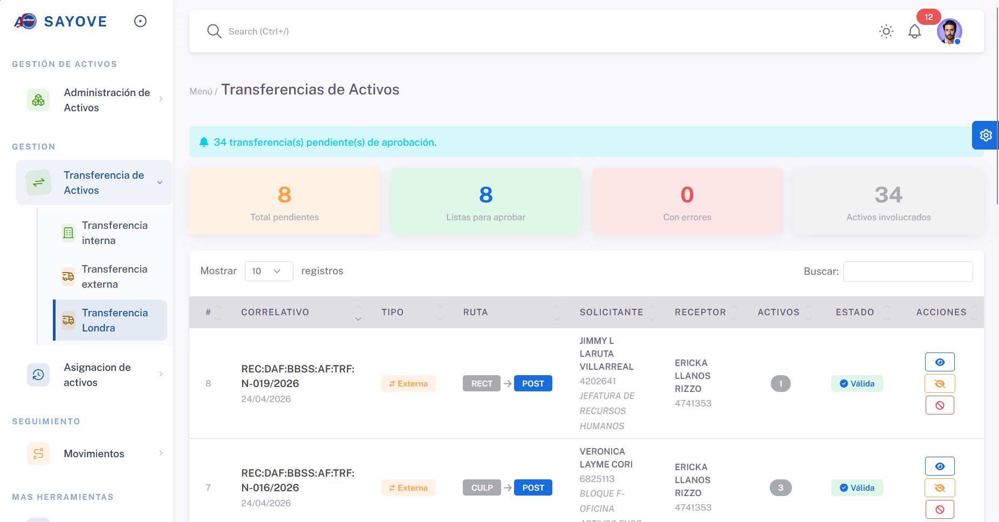

<div align="center">

# 🏛️ Sistema de Gestión de Activos Fijos

### Plataforma institucional de control y monitoreo de activos fijos con interoperabilidad VSIAF

*Moderniza la gestión de activos del estado boliviano integrándose al sistema VSIAF a través de archivos DBF.*

[](https://www.java.com/)
[](https://spring.io/projects/spring-boot)
[](https://www.thymeleaf.org/)
[](https://www.postgresql.org/)
[]()
[](http://sayove.uap.edu.bo)

[🌐 Ver Sistema](http://sayove.uap.edu.bo) · [🐛 Reportar Bug](https://github.com/Srkiwi2/NOMBRE_REPO/issues) · [✨ Solicitar Feature](https://github.com/Srkiwi2/NOMBRE_REPO/issues)

</div>

---

## 📸 Capturas del Sistema





> 🖼️ *Screenshots próximamente...*

---

## 🧩 ¿Qué problema resuelve?

Las instituciones públicas bolivianas están obligadas por decreto de estado a utilizar el **VSIAF** (Sistema Integrado de Administración Financiera), un sistema ejecutable de muchos años con grandes limitaciones operativas:

| Limitación del VSIAF | Solución que ofrece este sistema |
|---|---|
| ❌ Lento en el registro de activos | ✅ Registro rápido, completo e intuitivo |
| ❌ Reportes limitados y poco detallados | ✅ Reportes avanzados y personalizados |
| ❌ Monitoreo deficiente del inventario | ✅ Monitoreo en tiempo real del estado de activos |
| ❌ Gestión difícil de transferencias y asignaciones | ✅ Flujos claros de transferencia y asignación |
| ❌ Sin trazabilidad de modificaciones | ✅ Historial completo de cambios por activo |

Este sistema actúa como **capa moderna sobre el VSIAF**: el personal trabaja en una interfaz ágil y la institución mantiene su cumplimiento reglamentario, ya que ambos sistemas conviven en el mismo servidor institucional y se sincronizan vía archivos **DBF**.

---

## ✨ Funcionalidades Principales

### 📦 Gestión de Activos
- [x] Registro completo de activos fijos nuevos
- [x] Clasificación según **Partida 40000** del Clasificador Presupuestario Boliviano
- [x] Agrupación por **grupos contables** según normativa vigente
- [x] Historial de modificaciones por activo

### 🔁 Procesos de Activos
- [x] **Transferencias** de activos entre unidades/departamentos
- [x] **Asignaciones** de activos a responsables o dependencias
- [x] **Revaluos** de activos según normativa contable
- [x] Control de estado: activo, dado de baja, en reparación, etc.

### 📊 Reportes y Monitoreo
- [x] Reportes institucionales detallados por área, grupo, tipo o responsable
- [x] Monitoreo del inventario institucional completo
- [x] Generación de informes exportables
- [x] Trazabilidad de todos los movimientos de activos

### 🔗 Interoperabilidad con VSIAF
- [x] Sincronización de datos vía **archivos DBF** a través de red local
- [x] Ambos sistemas corriendo en **máquinas virtuales** del servidor institucional
- [x] Compatibilidad sin modificar la estructura obligatoria del VSIAF
- [x] Lectura y procesamiento de datos del sistema legado

---

## 🛠️ Stack Tecnológico

| Capa | Tecnología |
|------|-----------|
| **Backend** | Java 17 + Spring Boot 3 |
| **Frontend** | Thymeleaf + HTML/CSS/JS |
| **Base de Datos** | PostgreSQL |
| **Interoperabilidad** | Archivos DBF (dBase) vía red LAN |
| **Infraestructura** | Servidor privado institucional (máquinas virtuales) |
| **Build** | Maven |

---

## 🏗️ Arquitectura del Sistema

```
┌─────────────────────────────────────────────────┐
│           SERVIDOR INSTITUCIONAL (LAN)           │
│                                                  │
│  ┌──────────────────┐    ┌───────────────────┐  │
│  │  Sistema Activos │◄──►│      VSIAF        │  │
│  │  (Spring Boot)   │    │  (Sistema legado) │  │
│  │                  │    │                   │  │
│  │   PostgreSQL     │    │  Archivos .DBF    │  │
│  └──────────────────┘    └───────────────────┘  │
│           ▲                      ▲               │
│           │    Interoperabilidad │               │
│           │    vía red y DBF     │               │
└───────────┼──────────────────────┼───────────────┘
            │                      │
         Personal              Reglamento
       institucional           del Estado
                               Boliviano
```

---

## 🚀 Instalación y Ejecución Local

### Prerrequisitos

- [Java 17+](https://adoptium.net/)
- [Maven 3.8+](https://maven.apache.org/)
- [PostgreSQL 14+](https://www.postgresql.org/download/)
- Acceso a archivos DBF del VSIAF (para funciones de interoperabilidad)

### Pasos

**1. Clona el repositorio**
```bash
git clone https://github.com/Srkiwi2/NOMBRE_REPO.git
cd NOMBRE_REPO
```

**2. Crea la base de datos**
```sql
CREATE DATABASE activos_fijos;
```

**3. Configura la aplicación**

Edita `src/main/resources/application.properties`:
```properties
spring.datasource.url=jdbc:postgresql://localhost:5432/activos_fijos
spring.datasource.username=TU_USUARIO
spring.datasource.password=TU_CONTRASEÑA
spring.jpa.hibernate.ddl-auto=update

# Ruta a los archivos DBF del VSIAF
vsiaf.dbf.path=//RUTA_RED/archivos_dbf/
```

**4. Ejecuta el proyecto**
```bash
mvn clean install
mvn spring-boot:run
```

**5. Accede al sistema**
```
http://localhost:8080
```

> ⚠️ **Nota:** La interoperabilidad con VSIAF requiere acceso a la red interna institucional y a los archivos DBF compartidos. En entornos locales sin dicho acceso, las funciones de sincronización estarán limitadas.

---

## 📁 Estructura del Proyecto

```
activos-fijos/
├── src/
│   ├── main/
│   │   ├── java/
│   │   │   └── com/activosfijos/
│   │   │       ├── controller/      # Controladores MVC
│   │   │       ├── model/           # Entidades JPA
│   │   │       ├── repository/      # Repositorios JPA
│   │   │       ├── service/         # Lógica de negocio
│   │   │       └── vsiaf/           # Módulo de interop. DBF
│   │   └── resources/
│   │       ├── templates/           # Vistas Thymeleaf
│   │       ├── static/              # CSS, JS, imágenes
│   │       └── application.properties
├── pom.xml
└── README.md
```

---

## 🌐 Sistema en Producción

El sistema está desplegado en el servidor institucional:

**👉 [http://sayove.uap.edu.bo](http://sayove.uap.edu.bo)**

> 🔒 El acceso está restringido al personal autorizado de la institución.

---

## 📜 Contexto Normativo

Este sistema opera bajo el marco regulatorio boliviano:

- **VSIAF** — Sistema Integrado de Administración Financiera del Estado
- **Partida 40000** — Clasificador Presupuestario para Activos Fijos
- **Grupos Contables** — Normativa de clasificación contable institucional
- **Decreto de Estado** — Uso obligatorio del VSIAF en entidades públicas

---

## 👤 Autor

**Srkiwi2**

[](https://github.com/Srkiwi2)

---

## 📄 Licencia

Desarrollado como sistema de apoyo interno para una institución pública boliviana.
Todos los derechos reservados © 2024 Srkiwi2.

---

<div align="center">

*Modernizando la administración pública boliviana — Bolivia 🇧🇴*

</div>
